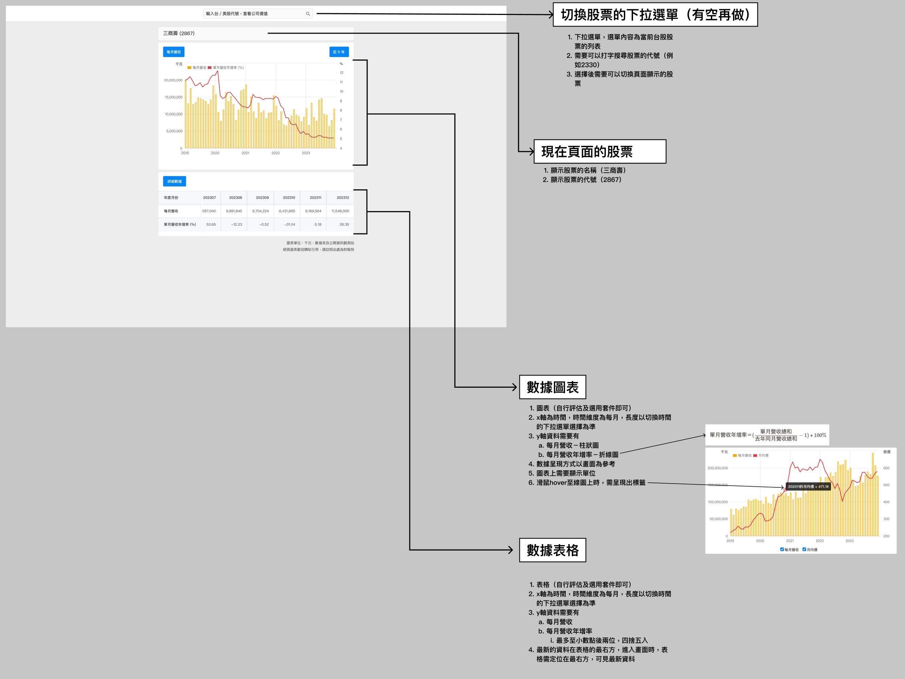

# Stark Tech前端評測 (1)

# 評測範疇

1. 參考提供的設計圖與提供的網站，將該網站的功能按照敘述實作（一頁）

# 評測技術要求

- 語言 Typescript
- 前端框架 React
    - NextJS 佳
    - 使用React functional component
- 使用Component Library
    - MUI 佳，並且有設定Theme
- 良好的Component切分

# 評測畫面說明

- 畫面主要參考財報狗的畫面，因為財報狗上有些數據無法從finmind取得，因此有調整畫面（包括選用的數據內容），財報狗上的部分供參考操作情境、數據及計算結果可參考正確性，需留意不是完全按照財報狗開發

### 參考相似功能網站

- 財報狗：hps://statementdog.com/analysis/2330/monthly-revenue
- 雅虎股市：https://tw.stock.yahoo.com/quote/2330.TW/revenue

# 資料API

- 請使用finmind註冊免費會員：https://finmindtrade.com/analysis/#/data/api
- 股票的清單：資料集中，技術面的台股總覽（TaiwanStockInfo）
- 每月營收：資料集中，基本面的月營收表（TaiwanStockMonthRevenue）

# 繳交內容

1. Github Repo
    1. 可以運行的程式
    2. README說明啟動方式、部署規劃、任何需要補充的內容等
2. （加分）提供真實部署的網址